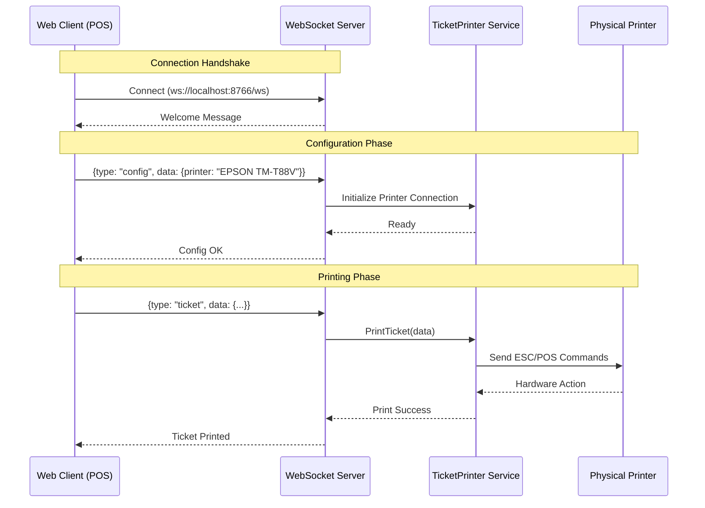

# Printer Daemon


> A lightweight, high-performance WebSocket server designed to bridge the gap between web-based POS applications and
physical ticket printers.


## Overview

**Printer Daemon** solves a common challenge in web-based Point of Sale (POS) systems: direct communication with
hardware printers. By running as a local service, it exposes a WebSocket endpoint that web clients can connect to,
enabling direct, low-latency control over thermal printers using ESC/POS commands.

Key features include:

- **Real-time Communication:** Bidirectional WebSocket interface.
- **Hardware Abstraction:** Supports standard ESC/POS printers (Epson, Star, etc.).
- **Dynamic Templating:** Flexible ticket layouts configurable via JSON.
- **Windows Optimization:** Specialized handling for Windows Print Spooler to ensure immediate printing.

## Architecture

The system follows a clean layered architecture, separating the WebSocket transport layer from the core printing logic.



## Installation

### Prerequisites

- **Go 1.24** or higher
- **Task** (optional, for build automation)
- A configured Windows printer (shared or local)

### Build from Source

1. Clone the repository:
   ```bash
   git clone https://github.com/adcondev/printer-daemon.git
   cd printer-daemon
   ```

2. Install dependencies:
   ```bash
   go mod tidy
   ```

3. Run the application:
   ```bash
   # Using Go directly
   go run cmd/printer-daemon/main.go

   # OR using Taskfile
   task run
   ```

## Usage

Once the server is running (default port: `8766`), you can connect to it using any WebSocket client.

**Endpoint:** `ws://localhost:8766/ws`

### Protocol

The server accepts JSON messages with the following structure:

```json
{
  "tipo": "ticket",
  "datos": {
    ...
  }
}
```

#### Message Types

1. **`config`**: Initialize the printer connection.
   ```json
   {
     "tipo": "config",
     "datos": {
       "printer": "Name_Of_Your_Printer",
       "debug": true
     }
   }
   ```

2. **`template`**: Configure the ticket layout (visibility of fields).
   ```json
   {
     "tipo": "template",
     "datos": {
       "ticketWidth": 80,
       "verLogotipo": true,
       "verFolio": true
       // ... other fields
     }
   }
   ```

3. **`ticket`**: Send the transaction data to print.
   ```json
   {
     "tipo": "ticket",
     "datos": {
       "folio": "A-123",
       "total": 150.00,
       "conceptos": [ ... ]
     }
   }
   ```

## Contributing

Contributions are welcome! Please feel free to submit a Pull Request.

1. Fork the project
2. Create your feature branch (`git checkout -b feature/AmazingFeature`)
3. Commit your changes (`git commit -m 'Add some AmazingFeature'`)
4. Push to the branch (`git push origin feature/AmazingFeature`)
5. Open a Pull Request

## License

Distributed under the MIT License. See `LICENSE` for more information.
